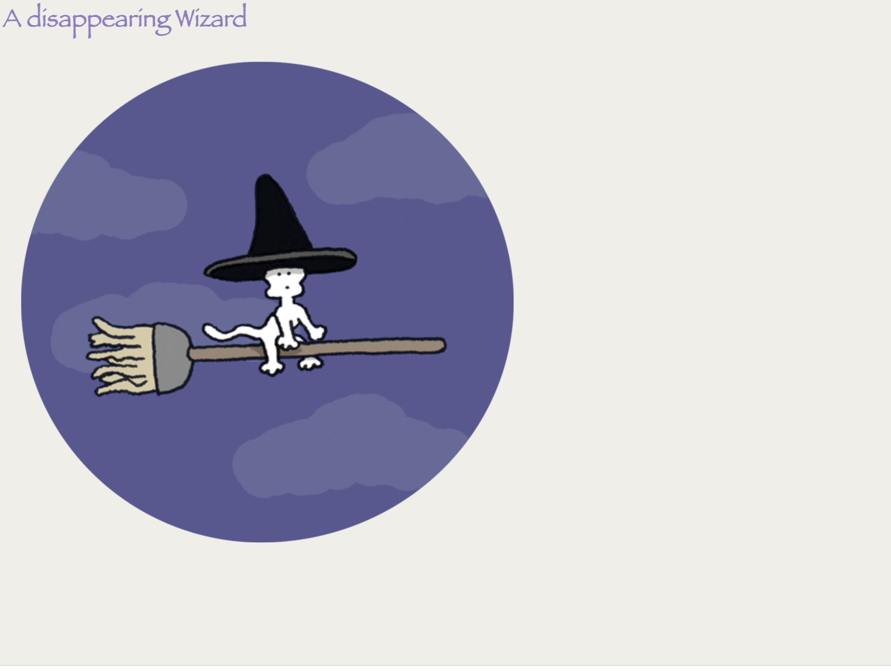

# AnimatedWizard
Created a small animation, spent a lot of time on studying animations; it's fascinating to know that there is a lot to creating amazing animations.
Here I have made a small attempt to create my first one. I used Animated.css library which is very helpful. Wanted to use some jQuery along
with it but haven't
been able to do so yet.

